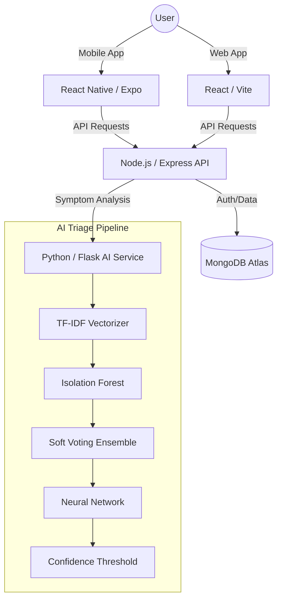

# 🏥 AI-Powered E-Channeling System

[](https://react.dev/)
[](https://reactnative.dev/)
[](https://expressjs.com/)
[](https://nodejs.org/)
[](https://www.mongodb.com/atlas)
[](https://www.python.org/)
[](https://flask.palletsprojects.com/)
[](https://render.com/)

A premium, full-stack healthcare ecosystem that revolutionizes patient-doctor interactions using Artificial Intelligence. This system provides an end-to-end solution for symptom analysis, specialist prediction, and seamless appointment management across Web and Mobile platforms.

<div align="center">
  
  
</div>

---

## 🌟 Vision
The **AI-Powered E-Channeling System** aims to bridge the gap between patient symptoms and professional medical care. By utilizing an advanced ensemble of machine learning models, the system ensures patients are directed to the most appropriate specialist, reducing diagnostic time and improving healthcare outcomes.

---

## ✨ Key Features

### 🤖 **Intelligent AI Triage Pipeline**
*   **Anomaly Detection:** Uses *Isolation Forests* to filter out unusual or non-medical symptom descriptions.
*   **Ensemble Prediction:** Combines *LightGBM*, *Support Vector Machines (SVM)*, and *Logistic Regression* for robust specialist recommendations.
*   **Deep Learning Boost:** Integrates a *Neural Network* (Keras) as an optional confidence booster for complex symptom patterns.
*   **Confidence Thresholding:** Implements a strict 40% confidence threshold to ensure reliability, defaulting to a General Physician for low-confidence results.

### 📱 **Premium Mobile Experience**
*   Built with **React Native & Expo**, offering a native feel on both iOS and Android.
*   **Dynamic Theming:** Smooth system-wide Light and Dark mode transitions using reactive color tokens.
*   **Real-time Interaction:** Fast, responsive UI powered by **Zustand** state management and optimized `useStyles` hooks.
*   **Native Navigation:** Utilizing **Expo Router** for seamless file-based routing and deep-linking capabilities.

### 💻 **Professional Web Dashboard**
*   High-performance **Vite + React 18** frontend with **Tailwind CSS v4** for modern styling.
*   **Data Visualization:** Interactive analytics dashboards for doctors and admins using **Recharts**.
*   **Medical Reporting:** Integrated **JSPDF** support for generating professional medical journals and appointment reports.
*   **Role-Based Access Control (RBAC):** Specialized, secure interfaces for Admins, Doctors, and Patients.
*   **Responsive Architecture:** Fully optimized for desktops, tablets, and mobile browsers.

### 🔔 **Unified Notification System**
*   Cross-platform synchronization for appointment updates and medical alerts.
*   Intelligent polling engine with badge counts and real-time state management.

---

## 🏗️ System Architecture



---

## 🛠️ Technology Stack

| Component | Technology | Key Libraries |
| :--- | :--- | :--- |
| **Mobile App** | React Native (Expo) | Expo Router, Zustand, Axios, React Native Paper |
| **Web App** | React 18 (Vite) | Tailwind CSS v4, Recharts, JSPDF, Lucide React |
| **Backend API** | Node.js (Express) | Mongoose, JWT, Bcrypt, Dotenv |
| **AI Service** | Python 3.10 (Flask) | Scikit-Learn, LightGBM, TensorFlow, Joblib |
| **Database** | MongoDB Atlas | NoSQL Cluster |
| **Cloud Hosting** | Render | IaC via `render.yaml` |

---

## 📁 Project Structure

To help you navigate the codebase, here is where each service is located:

*   **`/web`** — **React Web Application** (Vite, Tailwind CSS v4)
*   **`/backend`** — **Express.js API** (Node.js, MongoDB)
*   **`/ai-service`** — **AI & ML Services** (Python, Flask, Scikit-Learn)
*   **`/mobile`** — **Mobile Application** (React Native, Expo)
*   **`/shared`** — Shared configuration and API utilities used across platforms.

---

## 🚀 Getting Started

### Prerequisites
*   **Node.js** (v18.0.0 or higher)
*   **Python** (v3.9 or higher)
*   **Expo Go** app (for mobile testing)
*   **MongoDB Atlas** account

### 1. Installation

Clone the repository and install dependencies for all modules:

```bash
git clone https://github.com/thuva18/AI-Powered_E-Channeling.git
cd AI-Powered_E-Channeling

# Install Backend dependencies
cd backend && npm install && cd ..

# Install Web dependencies
cd web && npm install && cd ..

# Install Mobile dependencies
cd mobile && npm install && cd ..

# Setup AI Service (Python)
cd ai-service
python -m venv venv
source venv/bin/activate # Windows: venv\Scripts\activate
pip install -r requirements.txt
cd ..
```

### 2. Environment Setup

Create `.env` files in each directory based on the following templates:

**Backend (`backend/.env`):**
```env
PORT=8000
MONGO_URI=your_mongodb_connection_string
JWT_SECRET=your_super_secret_key
```

**AI Service (`ai-service/.env`):**
```env
AI_PORT=5001
```

### 3. Running the Project

You can start the entire ecosystem using the provided unified startup script:

```bash
chmod +x start_project.sh
./start_project.sh
```

Alternatively, start services individually:
*   **Backend:** `cd backend && npm start` (Port 8000)
*   **AI Service:** `cd ai-service && python app.py` (Port 5001)
*   **Web:** `cd web && npm run dev` (Port 5173)
*   **Mobile:** `cd mobile && npx expo start` (Port 8081)

---

## 🧪 AI Model Details
The AI service utilizes a multi-stage pipeline to ensure clinical safety and prediction accuracy:
1.  **Text Processing:** Symptoms are vectorized using a pre-trained TF-IDF model with 2,311 features.
2.  **Safety Filter:** Isolation Forest checks if the input is within the distribution of known symptoms.
3.  **Ensemble Voting:** A soft-voting classifier combines predictions from LightGBM, SVM, and Logistic Regression.
4.  **Neural Refinement:** A deep neural network provides a 40% weighted influence on the final probability if high-confidence patterns are detected.

---

## ☁️ Deployment

This project is configured for **Zero-Config Deployment** on Render. The `render.yaml` blueprint manages the entire infrastructure:

1.  **Web Service (Backend):** Node.js API.
2.  **Web Service (AI):** Python Flask service.
3.  **Static Site (Frontend):** React/Vite build with SPA routing rules.

Simply connect your GitHub repository to Render and it will automatically detect the blueprint.

---

## 🤝 Contributing
Contributions are what make the open-source community such an amazing place to learn, inspire, and create. Any contributions you make are **greatly appreciated**.

1.  Fork the Project
2.  Create your Feature Branch (`git checkout -b feature/AmazingFeature`)
3.  Commit your Changes (`git commit -m 'Add some AmazingFeature'`)
4.  Push to the Branch (`git push origin feature/AmazingFeature`)
5.  Open a Pull Request

---

## 📝 License
Distributed under the MIT License. See `LICENSE` for more information.

---

<div align="center">
  Built with ❤️ for better Healthcare.
</div>