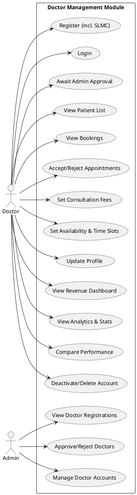
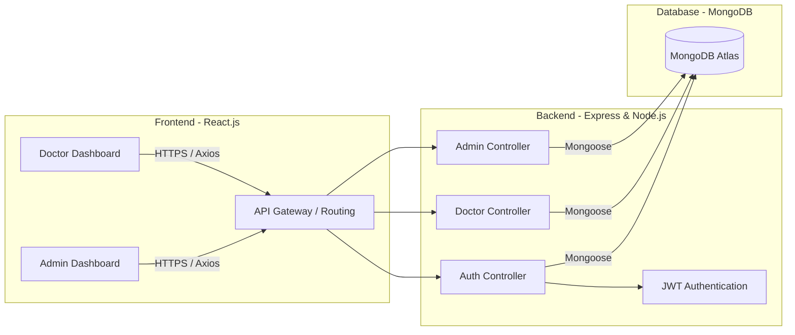
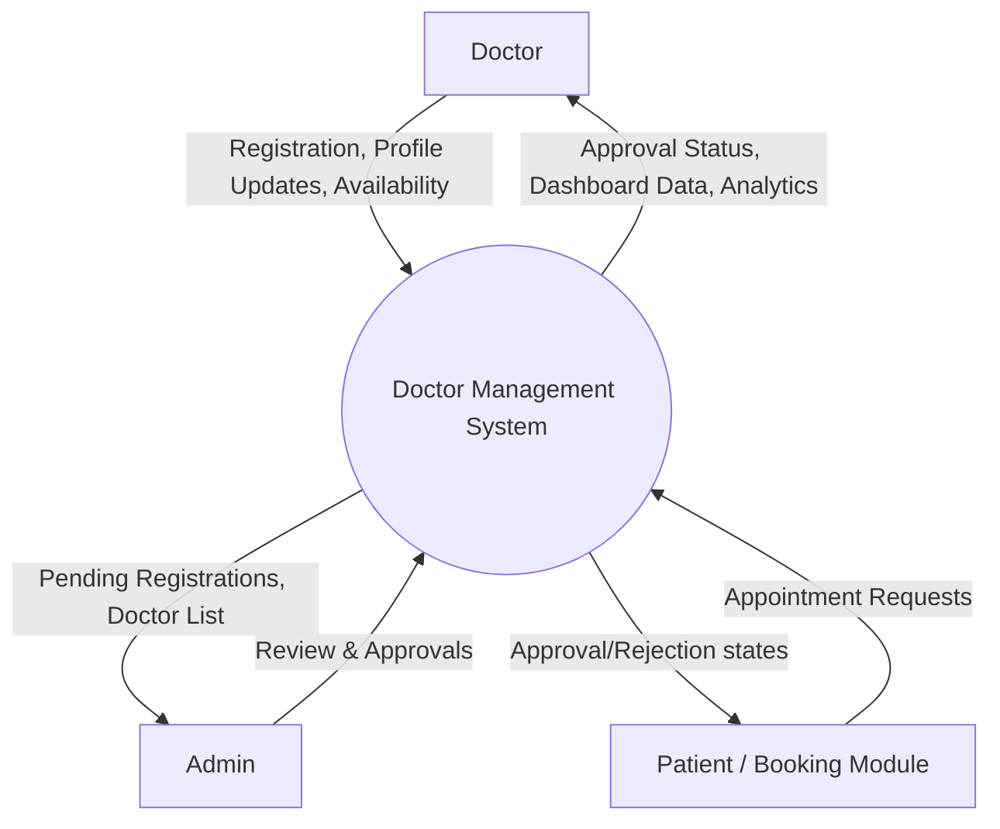
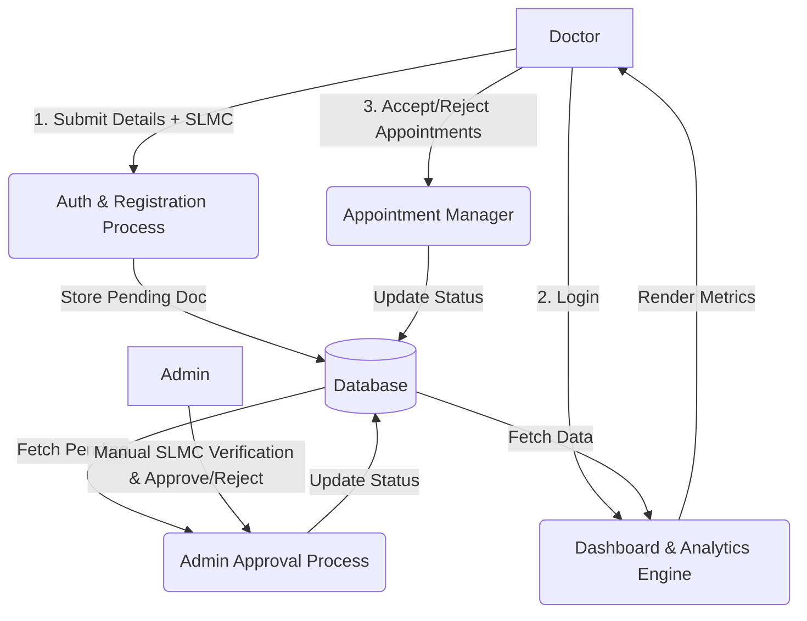

# System Design Documentation: Doctor Management Module

## 1️⃣ Functional Requirements

### Doctor Role
*   **Authentication & Registration:** Register using credentials including SLMC Registration Number; Login securely.
*   **Access Control:** Await admin approval before gaining full system access.
*   **Patient & Booking Viewing:** View patient list; View and manage bookings (read-only views of incoming booking requests, assuming other modules handle booking creation).
*   **Appointment Management:** Accept or reject appointments based on availability and capacity.
*   **Fees & Availability:** Set and toggle consultation fees; Set availability (working days, hours) and maximum daily time slots.
*   **Profile Management:** Update profile details (qualifications, bio, contact info).
*   **Analytics & Dashboard:** View revenue dashboard; View personal analytics and performance statistics; Compare performance metrics with other doctors (anonymously).
*   **Account Management:** Deactivate or permanently delete their account.

### Admin Role
*   **Doctor Registrations:** View all pending doctor registrations.
*   **Approval Workflow:** Review SLMC details and approve or reject doctor applications.
*   **Account Management:** Manage existing doctor accounts (suspend, revoke access, delete).

---

## 2️⃣ Required Deliverables

### 1. Use Case Diagram (PlantUML)


### 2. System Architecture Diagram (MERN Based)


### 3. Database Schema Design (MongoDB)
**1. User Collection (Users)** - *Handles shared authentication*
```json
{
  "_id": "ObjectId",
  "email": "String (Unique)",
  "passwordHash": "String",
  "role": "Enum ['DOCTOR', 'ADMIN', 'PATIENT']",
  "createdAt": "Date",
  "updatedAt": "Date"
}
```

**2. Doctor Collection (Doctors)**
```json
{
  "_id": "ObjectId",
  "userId": "ObjectId (ref: Users)",
  "firstName": "String",
  "lastName": "String",
  "slmcNumber": "String (Unique)",
  "specialization": "String",
  "approvalStatus": "Enum ['PENDING', 'APPROVED', 'REJECTED']",
  "consultationFee": "Number",
  "availability": [
    {
      "day": "Enum ['MONDAY', 'TUESDAY', ...]",
      "startTime": "String (HH:mm)",
      "endTime": "String (HH:mm)",
      "maxSlots": "Number"
    }
  ],
  "profileDetails": {
    "bio": "String",
    "qualifications": ["String"],
    "experienceYears": "Number",
    "contactNumber": "String"
  },
  "isActive": "Boolean"
}
```

**3. Appointment/Booking Collection** *(To be linked with other modules)*
```json
{
  "_id": "ObjectId",
  "doctorId": "ObjectId (ref: Doctors)",
  "patientId": "ObjectId (ref: Patients)",
  "appointmentDate": "Date",
  "status": "Enum ['PENDING', 'ACCEPTED', 'REJECTED', 'COMPLETED']",
  "paymentStatus": "Enum ['PAID', 'UNPAID']"
}
```

### 4. Data Flow Diagrams (DFD)

#### Level 0 DFD (Context Diagram)


#### Level 1 DFD


### 5. SWOT Analysis
*   **Strengths:** Highly secure registration (thorough manual SLMC verification workflow), dedicated performance analytics, clear separation of roles (Admin vs. Doctor).
*   **Weaknesses:** Doctors cannot independently activate accounts without Admin intervention, potentially slowing down onboarding. (No public SLMC API available for automated verification).
*   **Opportunities:** Integration with external SLMC APIs for automated validation; adding AI-based scheduling insights.
*   **Threats:** High dependency on data privacy (HIPAA compliance if applicable), risk of unauthorized data access if JWT is compromised.

### 6. REST API Endpoint Structure

**Auth & Registration:**
*   `POST /api/v1/auth/doctor/register` - Register a new doctor.
*   `POST /api/v1/auth/doctor/login` - Login and receive JWT.

**Admin Operations:**
*   `GET /api/v1/admin/doctors/pending` - View pending registrations.
*   `PATCH /api/v1/admin/doctors/:id/approve` - Approve/reject doctor.
*   `DELETE /api/v1/admin/doctors/:id` - Manage/remove account.

**Doctor Operations:**
*   `GET /api/v1/doctors/profile` - Fetch profile details.
*   `PUT /api/v1/doctors/profile` - Update profile, fees, and bio.
*   `PUT /api/v1/doctors/availability` - Set working hours and max slots.
*   `GET /api/v1/doctors/patients` - List associated patients.
*   `GET /api/v1/doctors/appointments` - List booking requests.
*   `PATCH /api/v1/doctors/appointments/:id/status` - Accept or reject appointment.
*   `GET /api/v1/doctors/analytics` - View revenue, stats, and peer comparison.
*   `DELETE /api/v1/doctors/account` - Deactivate/delete account.

### 7. Security Considerations
*   **Authentication:** Stateless JWT-based authentication with short-lived access tokens and secure, HTTP-only refresh tokens.
*   **Role-Based Access Control (RBAC):** Express middlewares (`isAdmin`, `isApprovedDoctor`) to protect specific routes.
*   **Password Security:** Hashing via `bcryptjs` before DB insertion.
*   **Validation:** Strict input sanitization using `express-validator` to prevent NoSQL Injection and XSS attacks.
*   **Rate Limiting:** Implement `express-rate-limit` on login and registration routes to prevent brute-force attacks.

### 8. UI/UX Design Structure
*   **Color Palette:** Clean healthcare aesthetics (e.g., Trust Blue `#0052CC`, Crisp White `#FFFFFF`, Success Green `#36B37E`).
*   **Typography:** Modern Sans-Serif (e.g., Inter, Roboto).
*   **Layout Structure:**
    *   **Sidebar Navigation:** Dashboard, Appointments, My Patients, Analytics, Profile Settings.
    *   **Top Header:** Breadcrumbs, Notifications Bell, Profile Dropdown.
    *   **Dashboard View:** 
        *   Top row: KPI Cards (Total Revenue, Appointments Today, Pending Requests).
        *   Middle row: Revenue Area Chart, Performance Radar Chart (vs. Peers).
        *   Bottom row: Recent Appointment Requests table with Quick "Accept" / "Reject" inline buttons.

### 9. Folder Structure for MERN Implementation
```text
project-root/
│
├── frontend/                   # React Frontend
│   ├── src/
│   │   ├── assets/             # Images, icons
│   │   ├── components/         # Reusable UI (Buttons, Modals, Cards)
│   │   ├── layouts/            # Dashboard layout, Auth layout
│   │   ├── pages/              # DoctorDashboard, AdminApprovals, Login
│   │   ├── services/           # Axios API calls
│   │   ├── store/              # Redux/Zustand state management
│   │   └── utils/              # Helper functions, validators
│
└── backend/                    # Node/Express Backend
    ├── src/
    │   ├── config/             # DB connection, env variables
    │   ├── controllers/        # Route logic (authController, doctorController)
    │   ├── middlewares/        # authMiddleware, rbacMiddleware, errorHandlers
    │   ├── models/             # Mongoose schemas (User, Doctor)
    │   ├── routes/             # API route definitions
    │   └── utils/              # JWT generator, password hasher
    └── server.js               # Entry point
```

### 10. Suggested Advanced Features for High Marks
1.   **Real-Time Notifications:** Use `Socket.io` to notify the doctor in real-time when a new patient appointment is requested, or when the Admin approves their registration.
2.   **Data Export / Reporting:** Allow doctors to export their monthly revenue and appointment statistics as a `.pdf` or `.csv` file.
3.   **Algorithm-driven Peer Comparison:** A percentile ranking system that tells the doctor: *"You are in the top 15% of doctors in your specialization for patient satisfaction"* without exposing other doctors’ raw data.

---
